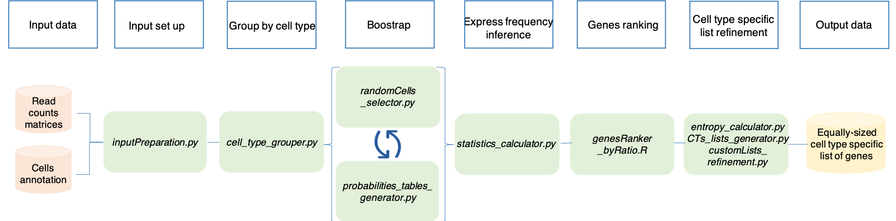
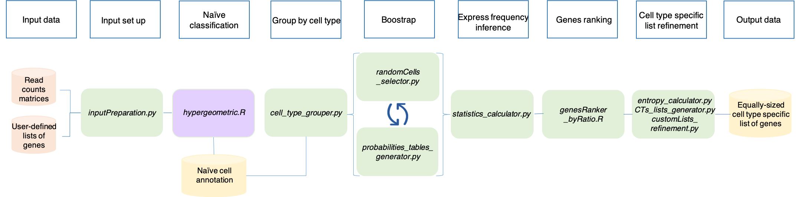

Advanced utilities
==================

SCALT presents other utilities behyond single cell classification:

1. the tool makes use of a scRNA seq read counts matrix and the corresponding **cells annotation** to build series of equally-sized cell type specific lists of genes, one per each cell type present in the annotation, in a deterministic fashion. This method is free of any human interpretation bias and relies on the ground concept on which SCALT is build which is that *each cell type has its own probability of expressing a gene*;
2. the application is able to build a series of equally-sized cell type specific lists of genes in a deterministic fashio starting from a scRNA seq read counts matrix and a collection of **user-defined lists of genes**, one per each hypothetical cell type. In first place, this method employes the counts matrix and the lists of genes proposed in the input in an **hypergeometric test** to produce a first layer of annotation. The so-called **naive** annotaion and the original counts matrix are subsequently utilized as inputs for utility described in the previous point.

Workflows
=========

Build the cell-type specific lists of genes starting from pre-annotated data
----------------------------------------------------------------------------

The steps and the relative programs of SCALT aimed to build the lists of genes from an annotaion file are summarized in the following workflow: 

1. **inputPreparation.py**
2. **cell_type_grouper.py**
3. **randomCells_selector.py**
4. **probabilities_tables_generator.py**
5. **statistics_calculator.py**
6. **genesRanker_byRatio.R**
7. **entropy_calculator.py**, **CTs_lists_generator.py** and **customLists_refinement.py**

Please, follow the next sections of the manual for instructions and tips.

Build the cell-type specific lists of genes starting from user-defined lists
----------------------------------------------------------------------------

The steps and the relative programs of SCALT aimed to build the lists of genes from a collection of user-defined lists are summarized in the following workflow: 

1. **inputPreparation.py**
2. **hypergeometric.R**
3. **cell_type_grouper.py**
4. **randomCells_selector.py**
5. **probabilities_tables_generator.py**
6. **statistics_calculator.py**
7. **genesRanker_byRatio.R**
8. **entropy_calculator.py**, **CTs_lists_generator.py** and **customLists_refinement.py**

Please, follow the next sections of the manual for instructions and tips.
