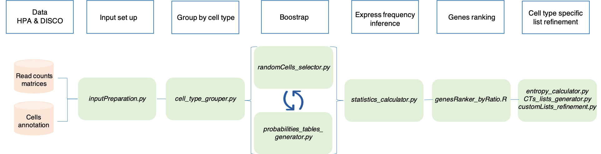

SCALT - Key features
====================

SCALT (Single Cell Annotation Likelihood Tool) introduces a paradigm-shift for the analysis of scRNAseq data. Cells are annotated to a specific type at individual level, by using a simple but elegant method based on maximum likelihood, **without** the need for **clustering**, **dimensionality reduction** or **manual annotation**. 

The main concept behind the tool is that each cell type has its own probability of expressing a gene. Based on that, SCALT leverages a collection of **471** lists of cell-type specific genes, constructed by extensive re-analysis of comprehensive and expert curated catalogues i.e. **Human Protein Atlas** and **DISCO** employing a multi-step pipeline described in the following workflow:

