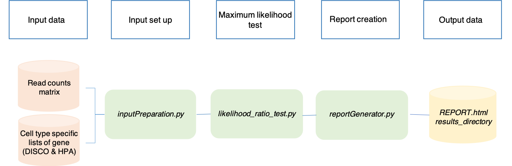

SCALT tools
===========

SCALT integrates three different pipelines for the analysis of single cell RNA sequencing data indicated by the following three programs:

1. **SCALT.py**;
2. **SCALT_AnnotaionListsBuilder.py**;
3. **SCALT_NaiveListsBuilder.py**.

SCALT: classification - Workflow
================

**SCALT.py** utilizes the pre-compiled cell type specific lists of genes originated from DISCO and Human Protein Atlas (HPA) database to classify cells from a scRNA seq counts matrix indipendently one from the others and without any kind of clustering or dimension reduction. 

A general workflow of the utility can be visualized in the following image:

SCALT: lists building from annotation - Workflow
================================================

**SCALT_AnnotaionListsBuilder.py**. 
The following picture reports a general workflow of the pipeline:

.. figure:: pictures/SCALT_listbuildAnno.png
   :align: center
   :scale: 40%

SCALT: lists building from user-defined lists - Workflow
========================================================

**SCALT_NaiveListsBuilder.py**
Here the general workflow is reported:

.. figure:: pictures/SCALT_listsbuildNaive.png
   :align: center
   :scale: 40%
